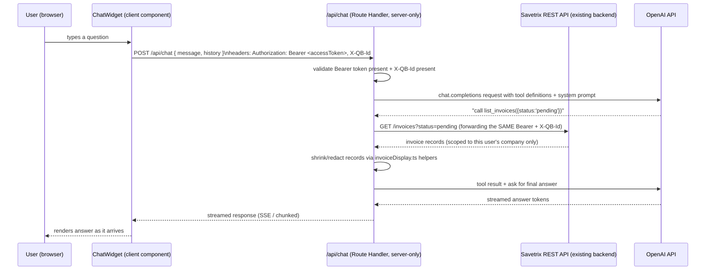

# Chatbot Feature — Architecture & Build Guide

**Goal:** an in-app AI chat assistant, backed by the OpenAI API, that can answer
natural-language questions about a signed-in user's own data — invoices,
vendors, GL accounts, tax codes, spend totals — using **Retrieval-Augmented
Generation (RAG)**: the model only answers using data we fetch from our own
backend and hand it, never from what it "remembers" from training.

This document was written after reading the actual codebase (not a generic
RAG tutorial). Every file path, endpoint, and pattern below is real and
already exists in this repo — you are extending an established system, not
starting from a blank slate. Read this whole document once before writing
any code, then use it as a checklist while you build.

> Per `AGENTS.md` at the repo root: this project pins a **Next.js 16** that
> has real breaking changes vs. older Next.js docs/training data (App Router
> route handlers, streaming, caching semantics). Before writing the backend
> route in this feature, skim `node_modules/next/dist/docs/` for the Route
> Handlers guide. Don't assume Next.js 13/14 patterns just work.

---

## 1. What already exists (read this before building anything)

This repo is a **frontend-only** Next.js app. There is currently:

- **No backend in this repo.** All real data (auth, invoices, vendors, GL
  accounts, tax codes, team, subscriptions) lives behind an external REST
  API: `NEXT_PUBLIC_API_URL` (default `https://api.savetrix.com/api`), a
  separate service maintained elsewhere. This repo only calls it over HTTP.
- **No backend search/filter/aggregate endpoint.** `src/lib/globalSearch.ts`
  says it outright: *"There is no backend search endpoint — every list here
  is already loaded into Redux by the pages that use it, so this just
  filters what's already in memory."* Same story for
  `src/lib/topVendors.ts` and `src/lib/outcomeMix.ts` — they fetch **all**
  invoices and compute totals/aggregates client-side in plain TypeScript,
  because the backend won't do it for you. **This chatbot inherits the same
  constraint**: there is no `/invoices/search?q=...` or `/chat` endpoint on
  the Savetrix backend to lean on. You build retrieval yourself, in this
  repo, against the plain CRUD endpoints that already exist.
- **No API routes in this Next.js app at all yet** (`src/app` has no `api/`
  folder). The chatbot's backend (the piece that holds the OpenAI key and
  talks to OpenAI) will be the **first backend code in this repo**, built as
  a Next.js Route Handler. Get this part right — see §3 and §7.
- **A sibling project, `mcp/mcp-server/`, already wraps this same backend**
  as a set of typed tools for AI agents (Claude, via MCP). This is not
  something you need to run, but it is the single best reference for this
  task: `mcp/mcp-server/src/client/*.ts` are thin, typed axios wrappers
  around every REST endpoint you'll need (`invoices.ts`, `vendors.ts`,
  `accounts.ts`, `taxcodes.ts`), and `mcp/mcp-server/src/tools/schemas.ts` +
  `.../tools/index.ts` show exactly which fields each tool takes and
  returns. **Read those files before inventing your own request shapes** —
  the endpoints, params, and response envelopes are already reverse-engineered
  there.

### The REST contract you'll be calling (confirmed from `src/store/*/*.Api.ts`)

Base URL: `NEXT_PUBLIC_API_URL` (e.g. `https://api.savetrix.com/api`)

| Method | Path | Purpose | Auth headers required |
|---|---|---|---|
| POST | `/auth/refresh-token` | refresh an expired access token | none (body has refreshToken) |
| GET | `/invoices?page=&limit=&status=` | list invoices, paginated (max `limit=100`/page) | Bearer, X-QB-Id |
| GET | `/invoices/:id` | one invoice, full detail | Bearer, X-QB-Id |
| PATCH | `/invoices/:id` | update extracted data / status | Bearer, X-QB-Id |
| GET | `/qb-connections` | list the user's connected QuickBooks companies | Bearer |
| GET | `/quickbooks/status` | connection status for one company | Bearer, X-QB-Id |
| GET | `/quickbooks/vendors?status=active\|inactive` | list vendors | Bearer, X-QB-Id |
| GET | `/quickbooks/accounts` | list GL accounts | Bearer, X-QB-Id |
| GET | `/quickbooks/taxcodes` | list tax codes (response is `data.items[]`, not `data.taxCodes[]` — see `quickBooksApi.ts` comment) | Bearer, X-QB-Id |

`Bearer` = `Authorization: Bearer <accessToken>` (the token stored in
`localStorage.accessToken`, read by `src/lib/api.ts`).
`X-QB-Id` = the id of the **currently active QuickBooks connection**
(`state.quickBooks.qbConnectionId`) — this is how the backend scopes every
invoice/vendor/account/tax-code query to one company. **Every one of these
endpoints will return the wrong company's data, or a 400, if you forget this
header.** This is the single most important fact in this whole document —
see §5.

### The data shapes you'll be feeding to the model

Don't redefine these — **import and reuse the existing TypeScript types**:

- `InvoiceRecord`, `ExtractedData`, `LineItem`, `StatusHistoryItem` —
  `src/store/invoice/invoiceSlice.ts`
- `Vendor`, `GLAccount`, `TaxCode` — `src/store/quickBooks/quickBooksSlice.ts`

And reuse the existing **display/derivation helpers** instead of
re-implementing "what does this invoice mean in plain English":

- `getInvoiceTitle`, `getInvoiceAmount`, `getInvoiceStatus`,
  `formatInvoiceDate`, `translateInvoiceReason` — `src/lib/invoiceDisplay.ts`
- `computeTopVendors` — `src/lib/topVendors.ts` (pattern to copy for any new
  "spend by X" aggregation the chatbot needs)
- `computeOutcomeMix` — `src/lib/outcomeMix.ts` (pattern for "how many
  invoices were auto/manual/failed over time")

If the chatbot ever describes an invoice differently than the Invoices page
does, that's a bug — these helpers are the single source of truth for both.

---

## 2. Why "RAG" here means something specific

RAG generically means: retrieve relevant documents, stuff them into the
model's context, generate an answer grounded in what was retrieved (instead
of the model's memorized training data). In a generic RAG tutorial that
means chunking documents and searching a vector database. **Here, the
"documents" are structured records from our own API (invoices, vendors, GL
accounts), not a pile of unstructured text** — so the right retrieval
strategy is different, and simpler, than a textbook vector-DB RAG pipeline.

We recommend **two phases**:

### Phase 1 (build this first, ship it): Tool-calling RAG, no vector DB

The model is given a small set of **retrieval tools** (OpenAI "function
calling") that wrap our own REST endpoints — e.g. `list_invoices`,
`get_invoice_detail`, `summarize_spend`, `list_vendors`. When the user asks
a question, the model decides which tool(s) to call, our server executes
them against the real backend (scoped to the signed-in user's company via
Bearer + X-QB-Id, exactly like every other screen in this app), and the
results are fed back to the model as its "retrieved context" before it
writes the final answer.

This **is** RAG — retrieval (tool calls against real data) feeding
generation (the model's answer) — it's just retrieval via structured API
calls instead of a vector similarity search. It matches how this codebase
already does search (`globalSearch.ts`) and aggregation (`topVendors.ts`):
fetch real records, then filter/compute in code. It needs **no new
infrastructure** (no vector database, no embeddings pipeline, no ingestion
job) and is fully buildable inside this repo alone. This is the MVP scope.

### Phase 2 (later, only if needed): add embeddings for semantic search at scale

Tool-calling RAG works well while a company's invoice count is small enough
to page through in a few API calls (hundreds, maybe low thousands). It
breaks down for semantic queries like *"find that invoice about the office
chairs"* once there are too many invoices to describe to the model in one
request, or when you want fuzzy/semantic matching over free-text fields
(line item descriptions, invoice notes) rather than exact filters.

Phase 2 adds:
- An embeddings pipeline: turn each invoice (or line item) into a short text
  blob (vendor, date, amount, description, GL account) and embed it via
  OpenAI's embeddings API.
- A vector store to hold those embeddings, **namespaced/filtered by
  `qbConnectionId`** so one company's vectors are never searchable by
  another (e.g. Pinecone with a `qbConnectionId` metadata filter, or
  Postgres + `pgvector` with a `qb_connection_id` column — Supabase is a
  reasonable managed option if this project doesn't already have a SQL
  database, since none exists in this repo today).
- A re-indexing job to keep embeddings fresh as invoices are scanned/edited.

**Open problem, flag to the team before starting Phase 2:** this repo has no
way to know when an invoice changes on the backend (no webhook, no
database access) — the only signal is "the logged-in user's browser fetched
updated data." A clean re-index needs either (a) a webhook/event from the
Savetrix backend team, or (b) a scheduled job (e.g. Vercel Cron hitting a
new route) that re-pulls and re-embeds every known company on a timer, which
needs a way to enumerate *all* companies/users with a service credential —
something that doesn't exist yet and is a real backend/security decision,
not something to improvise as an intern. **Don't start Phase 2 without
sign-off on how re-indexing will work.**

**Recommendation: build and ship Phase 1 first.** It already answers the
overwhelming majority of realistic questions ("what did we spend with Acme
last month", "list pending invoices", "what's vendor X's default GL
account") correctly and safely. Revisit Phase 2 once Phase 1 is in front of
real users and you know what it can't answer.

---

## 3. High-level architecture (Phase 1)



Key point: **the Next.js Route Handler is the only thing that talks to
OpenAI, and it is also the only thing that talks to the Savetrix backend on
the chatbot's behalf.** It always forwards the *calling user's own*
credentials to the Savetrix backend — it never uses a shared/service
credential to fetch "everyone's" data. This means the Savetrix backend's
existing per-user, per-company authorization is what keeps the chatbot from
ever seeing data it shouldn't. Don't try to build a separate authorization
system for the chatbot; piggyback on the one that already exists.

---

## 4. Backend design (the new Route Handler)

### 4.1 Where it lives

```
src/app/api/chat/route.ts        — POST handler, the only OpenAI touchpoint
src/lib/chatbot/tools.ts         — retrieval tool implementations (wraps Savetrix REST API)
src/lib/chatbot/toolSchemas.ts   — OpenAI tool/function JSON schemas
src/lib/chatbot/systemPrompt.ts  — the system prompt (see §4.4)
src/lib/chatbot/context.ts       — shrink/redact helpers (raw record -> compact record for the model)
```

This mirrors how `mcp/mcp-server/src/client/*.ts` (thin per-resource REST
wrappers) + `mcp/mcp-server/src/tools/*.ts` (tool registration) are already
split in the sibling project — same shape, different transport (HTTP route
instead of MCP protocol).

### 4.2 Auth: how the route handler gets the user's credentials

The browser already holds `accessToken` (in `localStorage`, via
`src/lib/storage.ts`) and the active `qbConnectionId` (in Redux,
`state.quickBooks.qbConnectionId`). The chat widget must send both on every
request to `/api/chat`:

```ts
fetch("/api/chat", {
  method: "POST",
  headers: {
    "Content-Type": "application/json",
    Authorization: `Bearer ${accessToken}`,
    "X-QB-Id": qbConnectionId,
  },
  body: JSON.stringify({ message, history }),
});
```

The route handler must:
1. Reject the request (401) if `Authorization` is missing — do **not** try
   to read `accessToken` out of `localStorage`/cookies server-side; Route
   Handlers run on the server and have no access to `localStorage`. The
   token must be sent explicitly in the request, same as every other API
   call this app makes.
2. Reject (400, with a clear message) if `X-QB-Id` is missing. Every
   retrieval tool needs it. A missing QB connection means "user hasn't
   connected QuickBooks yet" — the widget should handle that state before
   ever letting the user send a message (see §6).
3. Forward both headers, unmodified, into every call the tool functions make
   to the Savetrix backend. Never swap in a different token.

### 4.3 Retrieval tools (Phase 1)

Each tool is a plain async function, callable both by the OpenAI
tool-calling loop and by unit tests. Model them directly on
`mcp/mcp-server/src/client/invoices.ts` / `vendors.ts`, adapted to take
`(accessToken, qbConnectionId, args)` instead of an MCP session object.

Minimum tool set for a useful MVP:

- **`list_invoices(args: { status?, vendorName?, fromDate?, toDate?, limit? })`**
  Calls `GET /invoices` with pagination (copy the pagination loop from
  `getInvoices` in `src/store/invoice/invoiceApi.ts` — it already handles
  multi-page fetches correctly; don't re-derive that logic). Since the
  backend doesn't support `vendorName`/date filtering server-side, apply
  those filters **in code**, after fetching, the same way `globalSearch.ts`
  does. Cap the returned list (e.g. 20 most relevant) and run every result
  through the shrink/redact step (§4.5) before it goes anywhere near the
  model.

- **`get_invoice_detail(args: { invoiceId })`**
  `GET /invoices/:id`. Use when the user asks about one specific invoice by
  name/number.

- **`summarize_spend(args: { groupBy: "vendor" | "month" | "status", fromDate?, toDate? })`**
  **Do not let the model add up numbers itself.** Fetch the relevant
  invoices, then compute sums/counts in TypeScript — directly following the
  pattern in `computeTopVendors` (`src/lib/topVendors.ts`) and
  `computeOutcomeMix` (`src/lib/outcomeMix.ts`). Return only the aggregated
  totals to the model. This is the single most important tool for
  correctness — see §7's arithmetic warning.

- **`list_vendors(args: { status?: "active" | "inactive" })`**,
  **`list_gl_accounts()`**, **`list_tax_codes()`**
  Thin wrappers over `GET /quickbooks/vendors`, `/quickbooks/accounts`,
  `/quickbooks/taxcodes`. Useful for "what's vendor X's default category",
  "what tax codes do we have", etc.

Currency note: invoices can carry different `currency` values
(`extractedData.currency`). Any aggregation tool must **group by currency**
and never silently sum different currencies together — `topVendors.ts`
already tracks `currency` alongside each total for this exact reason; keep
doing that.

### 4.4 System prompt requirements

The system prompt (in `src/lib/chatbot/systemPrompt.ts`) must instruct the
model to:
- Only answer factual questions about the user's data by calling a tool
  first — never guess or recall invoice/vendor facts from its own training.
- If a tool returns no results, say so plainly rather than inventing a
  plausible-sounding answer.
- State amounts with their currency, never a bare number.
- Make clear it's answering for **the currently active QuickBooks company**
  only (name it, if available) — not "all your data everywhere."
- Not give tax/legal/accounting advice — this is a data lookup assistant,
  not an accountant. A short disclaimer for anything that veers into "should
  I..." territory is appropriate.
- Not fabricate invoice IDs, vendor IDs, or GL account IDs in its answer
  text — only reference ones that actually came back from a tool call.

### 4.5 Shrinking/redacting records before they reach OpenAI (do this — see §7)

Raw `InvoiceRecord` objects carry fields that should **never** go to the
model: `file.s3Url`/`s3Key` (internal storage locations), Mongo `_id`s for
unrelated sub-resources, `confidenceBreakdown` internals, full
`bankingDetails`. Write one mapper,
e.g. `toChatContext(invoice: InvoiceRecord)`, that reuses
`invoiceDisplay.ts`'s helpers to produce a small, purpose-built object:

```ts
{
  id: invoice._id,               // fine — it's just an opaque reference id, not a secret
  title: getInvoiceTitle(invoice),
  amount: getInvoiceAmount(invoice),
  status: getInvoiceStatus(invoice.postedStatus),
  date: formatInvoiceDate(invoice.extractedData?.invoiceDate),
  vendor: invoice.extractedData?.vendorName,
}
```

This both protects sensitive fields (banking details, storage URLs) and
keeps token usage (= cost, = latency) down, which matters a lot once you're
listing dozens of invoices per tool call.

### 4.6 Streaming and runtime

- Use OpenAI's streaming mode (`stream: true` on the chat completion /
  responses call) and return a streamed `Response` from the Route Handler
  (a `ReadableStream`), so the user sees tokens arrive live instead of
  waiting for the whole answer — this also avoids the request looking
  "hung" during a slow multi-tool-call turn.
- Declare `export const runtime = "nodejs"` in `route.ts` explicitly, since
  you'll be using the official `openai` Node SDK and axios (both need the
  Node runtime, not Edge).
- Check whatever Vercel plan this project deploys on for its serverless
  function duration limit, and set `export const maxDuration = ...`
  accordingly if a multi-tool-call turn could run long. Confirm this rather
  than assuming — plan limits change and get this wrong only once it's live.
- Add `openai` to `package.json` dependencies (`npm install openai`) — it
  is not currently a dependency of this repo.

---

## 5. Multi-tenancy & security — read this section twice

This is the highest-risk part of the feature, because it's financial data
and the mistake mode ("chatbot answers with the wrong company's numbers") is
silent — nothing crashes, it just quietly lies.

- **The `OPENAI_API_KEY` is a server secret.** It must be a plain
  environment variable, **never** prefixed `NEXT_PUBLIC_` (that prefix
  ships a variable straight into the browser bundle — every other env var
  in this project is `NEXT_PUBLIC_*` because none of them were secrets; this
  is the **first real secret** this repo will hold). Add it to
  `.env.local.example` as a commented placeholder (no real value), and set
  the real value only in Vercel's project environment variables. Never
  commit a real key.
- **Never call the OpenAI API from a client component.** All OpenAI calls
  happen inside `src/app/api/chat/route.ts`, server-side, full stop.
- **Every retrieval tool call must carry the requesting user's own
  `accessToken` + `X-QB-Id`, forwarded unmodified.** Do not introduce a
  service/admin credential "for convenience" — that would let the chatbot
  see across companies/users, defeating the backend's existing tenant
  isolation. If a tool needs data, it asks the Savetrix backend exactly the
  way `src/lib/api.ts` already does, with the same two headers.
- **Never cache tool results across requests without keying by both user
  and `qbConnectionId`.** If you add any caching later for cost/latency,
  the cache key must include both, with a short TTL — otherwise one
  company's cached invoice list can leak into another company's chat.
- **Chat history is session/company-scoped, same as everything else in this
  app.** Look at `src/store/sessionBoundary.ts` — every slice holding
  session data (`invoice`, `vendor`, `quickBooks`, `subscription`) resets on
  `isSessionBoundary` (login/logout) so one account's data can't survive
  into the next session on a shared browser. **If you store chat history in
  Redux, add it to that same reset list.** Additionally — and this is
  specific to this app's multi-company model, not something
  `sessionBoundary.ts` already covers — **clear/reset the chat conversation
  whenever `qbConnectionId` changes** (the user switched companies via the
  header switcher in `AppShell.tsx`). A conversation started while looking
  at Company A's invoices must not keep answering as if it's still Company
  A after the user switches to Company B.
- **Don't log full request/response payloads to the console** the way a lot
  of the existing `*Api.ts` thunks do (`console.log(JSON.stringify(response.data...))`
  is a repo-wide pattern for debugging). That's fine for connection status
  or vendor lists; it is **not** fine for chat messages or invoice payloads
  that may include banking details — keep logging to structural info
  (status codes, tool names called, timing) rather than full contents.

---

## 6. Frontend design

### 6.1 Where the chat widget lives

Mount the launcher in `src/components/shell/AppShell.tsx`'s header, next to
the existing Notifications bell button (around line 379). This is the
right spot because:
- `AppShell` only renders once the user is authenticated (`AuthGate` gates
  it), so the chatbot never appears on public/logged-out routes for free.
- It's already the place other global, always-available affordances live
  (`GlobalSearchBar`, notifications).
- The header already has access to `qbConnectionId` and `accessToken` via
  the same `useAppSelector` calls `AppShell` makes.

New files:

```
src/components/chatbot/ChatWidget.tsx     — "use client"; launcher button + panel
src/components/chatbot/ChatPanel.tsx      — message list + input, opened by the launcher
src/components/chatbot/ChatMessage.tsx    — one message bubble (user vs. assistant)
```

### 6.2 Panel placement and style

Open as a right-side drawer (fixed-position panel, similar treatment to the
company switcher dropdown already in `AppShell.tsx`, but taller — closer to
a full-height slide-over). Avoid the bottom-right corner — `DialogHost.tsx`
already anchors its toast stack there
(`fixed bottom-[var(--space-lg)] right-[var(--space-lg)]`), and a floating
chat bubble in the same corner will visually collide with toasts.

Use the existing design tokens and components — don't invent new colors or
spacing:
- Colors: `--color-primary` (teal, `#1fb6aa`) for the launcher and
  send/primary actions, `--color-trust-navy` for headers, same as
  `AppShell.tsx`.
- Spacing/radius: `var(--space-*)`, `rounded-md`/`rounded-lg` per
  `globals.css`'s `@theme` block.
- Components: `Button` (`src/components/ui/Button.tsx`, has a built-in
  `loading` state — use it for "sending"), `Spinner`, `EmptyState`,
  `ErrorState` (`src/components/ui`) for the panel's empty/loading/error
  states instead of writing new ones.

### 6.3 State management

A small Redux slice is worth adding for consistency with the rest of the
app (every other feature area — `auth`, `invoice`, `vendor`, `quickBooks`,
`subscription` — is a slice), even though the chat state itself is
lightweight:

```
src/store/chat/chatSlice.ts
```

Holds: `messages: ChatMessage[]`, `status: "idle" | "streaming" | "error"`,
`error`. Reset it:
- on `isSessionBoundary` (import from `src/store/sessionBoundary.ts`, same
  as every other slice's `extraReducers` — see `invoiceSlice.ts` for the
  exact pattern to copy), and
- on `qbConnectionId` change (see §5 — this one is chat-specific, not
  something `sessionBoundary.ts` gives you for free; wire it as a
  `useEffect` in `ChatWidget.tsx` watching `qbConnectionId` that dispatches
  a `clearChat` action, or as an extra matcher in the slice if you can key
  off the same action `AppShell.tsx`'s `handleSwitch` dispatches
  (`getQuickBooksStatus`)).

Don't persist chat history through `redux-persist` (the `quickBooks` slice
is the only persisted one today, deliberately limited to 3 fields — see
`src/store/index.ts`'s `quickBooksPersistConfig` comment). Chat history
containing financial data surviving a browser restart in plaintext
`localStorage` is not a decision to make silently; if persistence is wanted
later, that's a product decision to raise explicitly (see §9).

### 6.4 Sending a message and reading the stream

`src/lib/api.ts`'s shared axios instance is the convention for REST calls in
this app, but axios doesn't stream response bodies cleanly in the browser.
For this one endpoint, use the native `fetch` API and read the streamed
body directly:

```ts
const res = await fetch("/api/chat", {
  method: "POST",
  headers: {
    "Content-Type": "application/json",
    Authorization: `Bearer ${accessToken}`,
    "X-QB-Id": qbConnectionId,
  },
  body: JSON.stringify({ message, history }),
});
const reader = res.body?.getReader();
// read chunks, decode, append to the in-progress assistant message as they arrive
```

This is a deliberate, intentional deviation from "always use `src/lib/api.ts`"
— call it out in your PR description so reviewers don't flag it as an
inconsistency by accident.

### 6.5 UI states to handle explicitly

- **No QuickBooks connection yet**: disable the input, show an `EmptyState`
  pointing at `/accounting-software` to connect — mirror how
  `GlobalSearchBar.tsx` gates its own data fetches on
  `accessToken && qbConnectionId` before doing anything.
- **Sending / streaming**: show the in-progress assistant message with a
  typing indicator; disable the input while a request is in flight (don't
  allow concurrent messages).
- **Error** (network failure, OpenAI error, 401 from `/api/chat`): render
  via `ErrorState`, and if it's a 401 specifically, that likely means the
  access token expired — reuse the existing session-expiry flow
  (`sessionEmitter`/`SESSION_EXPIRED` in `src/lib/sessionManager.ts`) rather
  than inventing a separate "please log in again" message.
- **Accessibility**: the streaming answer region should be
  `aria-live="polite"` so screen readers announce it as it completes (not
  token-by-token, which would be unusable — batch announcements, e.g. once
  per completed sentence or on stream end). `Escape` closes the panel,
  matching `DialogHost.tsx`'s confirm dialog behavior.

---

## 7. Mistakes to specifically avoid

This list exists because these are concrete, repo-specific ways to get this
feature subtly wrong — not generic advice. Check every one of these before
calling the feature done.

1. **Naming the env var `NEXT_PUBLIC_OPENAI_API_KEY`.** This ships your key
   into the public JS bundle, readable by anyone who opens dev tools. Name
   it `OPENAI_API_KEY` (no `NEXT_PUBLIC_` prefix) and only reference it
   inside `src/app/api/chat/route.ts` (a server file).
2. **Calling OpenAI from a client component "just to try it quickly."**
   Even temporarily, this leaks the key. Always go through the route
   handler, even during local testing.
3. **Forgetting the `X-QB-Id` header on any Savetrix API call the tools
   make.** You'll either get a 400, or — worse — data from whichever
   connection the backend happens to default to, which can look like a
   correct answer while being the wrong company's numbers. Every tool
   function should take `qbConnectionId` as an explicit required parameter,
   not an optional one, so it's impossible to forget.
4. **Fetching only page 1 of invoices.** `GET /invoices` caps at
   `limit=100` per page. `getInvoices` in `src/store/invoice/invoiceApi.ts`
   already shows the correct multi-page fetch loop — copy that pattern, or
   any "how many invoices do we have" / "total spend" answer will silently
   undercount once a company passes 100 invoices.
5. **Letting the model compute sums/counts itself from a list of raw
   invoices in its context.** LLMs are unreliable at exact arithmetic over
   more than a handful of numbers. Any question involving totals ("how much
   did we spend with X", "how many invoices failed this month") must go
   through a tool that computes the aggregate in TypeScript (§4.3,
   `summarize_spend`) and hands the model the already-computed number to
   phrase into a sentence — never a list of raw amounts to add up itself.
6. **Sending full raw `InvoiceRecord` objects (with `file.s3Url`, internal
   Mongo ids, `confidenceBreakdown`, `bankingDetails`) into the OpenAI
   context.** Wastes tokens (cost + latency) and needlessly exposes
   internal/sensitive fields to a third-party API. Always map through a
   redaction/shrink step first (§4.5).
7. **Mixing up currencies in an aggregate.** Invoices can be in different
   currencies. `topVendors.ts` already tracks currency per total for this
   reason — any new aggregation tool must do the same, never sum
   USD + EUR into one number.
8. **Building a global/company-agnostic chat.** Every answer is implicitly
   scoped to the *active* `qbConnectionId`. If the user switches companies
   mid-conversation (via the header switcher), the old conversation's
   context is now stale/wrong — clear it (§5, §6.3), don't let it silently
   keep answering as the old company.
9. **Not resetting chat state on logout/login.** Copy the
   `isSessionBoundary` matcher pattern from `invoiceSlice.ts` /
   `vendorSlice.ts` exactly — otherwise account A's conversation can be
   visible after account B logs in on the same browser (this has been a
   real bug class in this codebase before, which is why every session-scoped
   slice already guards against it).
10. **No streaming.** A multi-tool-call OpenAI turn can take several
    seconds. Without streaming, that reads as "broken" to the user and risks
    hitting a serverless function timeout with no partial output to show
    for it. Stream from the start; don't bolt it on later.
11. **No rate limiting or cost cap.** An unauthenticated-feeling "ask
    anything" input backed by GPT + large data dumps can get expensive fast
    if abused (e.g. someone scripting rapid-fire requests). At minimum, cap
    how many invoices any single tool call can return, cap the model's max
    output tokens, and consider a simple per-user request rate limit before
    shipping publicly.
12. **Skipping the build gate.** Per this repo's `AGENTS.md`: `npx tsc
    --noEmit` alone is **not enough** — it misses SSR failures. Run
    `npx tsc --noEmit && npx next build` before considering any part of this
    done, even though the chat widget itself is a client component; a
    server-only import leaking into a client bundle (or vice versa) is
    exactly the class of bug that build catches and `tsc` alone won't.
13. **Guessing at Next.js 16 Route Handler APIs from memory/training data.**
    This project pins Next 16 specifically because it has real breaking
    changes from what most training data assumes. Check
    `node_modules/next/dist/docs/` for the current Route Handlers guide
    before writing `route.ts`.
14. **Persisting chat history to `localStorage` without thinking it
    through.** Unlike `sidebarPinned` (a harmless UI preference already
    persisted in `storage.ts`), chat history can contain real financial
    figures. Don't add silent persistence — if it's wanted, it's a decision
    to raise explicitly (§9), not a default to reach for.

---

## 8. Suggested build order

1. **Env + dependency setup**: add `OPENAI_API_KEY` to `.env.local` (and a
   placeholder in `.env.local.example`), `npm install openai`.
2. **Retrieval layer first, no OpenAI yet**: write
   `src/lib/chatbot/tools.ts` (§4.3) and manually test each function against
   the real backend (a scratch script or a temporary debug route) with a
   real `accessToken`/`qbConnectionId`, confirming correct pagination and
   correct company scoping before any AI is involved.
3. **Route handler, non-streaming first**: get `/api/chat` working end to
   end with a single OpenAI call (no tool calling yet) returning a plain
   JSON response, to validate the auth/header plumbing (§4.2).
4. **Add tool calling**: wire the tool schemas + the tool-call loop, confirm
   the model actually calls `list_invoices`/`summarize_spend` etc. and the
   answers are grounded (test with questions where you know the right
   answer from the Invoices page itself).
5. **Add streaming.**
6. **Frontend shell**: `ChatWidget`/`ChatPanel`/`ChatMessage`, wired to a
   mocked/stubbed response first, focusing on layout, states (§6.5), and
   the header launcher placement.
7. **Wire the real streamed API**, then the Redux slice + reset behavior
   (§6.3).
8. **Polish pass**: empty/loading/error states, accessibility, rate
   limiting/cost caps (§7.11), the `qbConnectionId`-switch reset (§5, §6.3).
9. **Full build gate**: `npx tsc --noEmit && npx next build`, then manually
   exercise it in the browser — golden path (a normal question), no-QB-connection
   state, a company switch mid-conversation, and a logout/login on the same
   browser.
10. Only after Phase 1 is live and validated: revisit Phase 2 (§2) with the
    team, if semantic search over large invoice volumes turns out to be
    needed.

---

## 9. Open questions — decide these before or during the build, not silently

These are product/infra calls, not implementation details — don't guess on
them; ask.

- **Which OpenAI model?** Trade-off between answer quality and per-message
  cost — worth picking deliberately rather than defaulting to the most
  expensive option.
- **Should the chatbot be gated behind a subscription plan?** This repo
  already has a plans/paywall UI (`src/app/plans`, `src/app/paywall`,
  `src/store/subscription/`), but per `README.md` it's currently **UI
  mockups only — no real billing is wired up**. Gating a real feature behind
  a mock paywall may or may not be intended; confirm before adding a gate.
- ~~**Should conversations persist across page reloads / devices?**~~
  **ANSWERED — see §10.** Phase 1 was ephemeral (client-side only, cleared on
  logout/company switch). Chat history now persists server-side, in this repo,
  without a Savetrix backend change.
- **Rate limits / cost budget** — concrete numbers (requests/user/day, max
  tokens/response) should come from whoever owns the OpenAI billing, not be
  invented ad hoc.
- **Phase 2 timing and re-indexing strategy** (§2) — explicitly needs
  backend-team input; don't start it solo.

---

## 10. Chat history (persisted conversations)

Answers §9's persistence question. Phase 1's conversation lived in Redux only
and vanished on reload, logout, or a company switch. Users can now browse,
reopen, and delete their past conversations, and only ever their own.

### 10.1 Why it is server-side, not localStorage

The obvious implementation is a `localStorage` array filtered by the signed-in
user's email. It was rejected, and any future variant of it should be too:

- **The rule can't be enforced there.** "Only your own conversations" becomes a
  `.filter()` running on the reader's own machine, over a single key holding
  *every* account that used that browser. Anyone with devtools reads all of it,
  and nothing clears it at logout.
- **It isn't persistence in the sense asked for.** It's per-browser. Signing in
  on a second device, or after a cache clear, shows an empty history.
- **Financial content.** These transcripts quote invoice totals, vendor names,
  and GL detail (§5) — the same data the rest of the app never keeps in plain
  browser storage.

### 10.2 Storage

One JSON document per user in a **private Vercel Blob store**
(`scantrix-chat-history`), at `chat-history/v1/<sha256(userId)>.json`.

- Blob is the only durable store this repo can use without standing up new
  infrastructure or a marketplace account (the MCP connector is deliberately
  stateless — `mcp/mcp-server/src/auth/tokens.ts`). Private access means blobs
  are unreachable by URL; every read goes through a route handler that has
  already established who is asking.
- The path is derived from the **verified** user id, never from request input,
  so "read another user's history" has no expressible request shape. Hashing
  keeps ids (and email-shaped ids) out of pathnames and logs.
- One document per user makes listing a single read and saving a single write,
  and makes the per-user caps trivially enforceable: 50 conversations, 200
  messages each, 8k characters per message, 1 MB per document — oldest
  conversations drop out first.
- Reads pass `useCache: false`. Saves overwrite the same pathname, and cached
  private reads can serve the previous version for up to 60s — long enough to
  show a user a list missing the message they just sent.
- Conditional writes (`ifMatch`) guard the read-modify-write, but Blob serves a
  **weak** etag (`W/"…"`) once a document grows, and a weak validator can never
  satisfy `If-Match`. Treat weak as "no usable precondition" — otherwise every
  save silently 412s once a user's history gets big. The last retry writes
  unconditionally: losing a concurrent tab's ordering beats losing the message
  the user just sent.

### 10.3 Identity — the whole security story

`src/lib/chatHistory/identity.ts`. This repo holds no signing secret for
Savetrix tokens (§4.2), so identity is established in two steps that must stay
in this order:

1. **Vouching** — call a backend endpoint that 401s on a bad token. A forged or
   expired token cannot survive it, because we are not the ones judging it.
2. **Subject** — read the user id out of the vouched-for token's own payload,
   or straight from the profile response when the backend supplies one.

Decoding a JWT payload without verifying its signature is only safe *because*
of step 1: since the backend issued the token, its payload is authentic, and an
attacker cannot mint one naming somebody else. If either step fails to produce
an id, the routes fail closed with 503 — never a shared or guessed bucket.
Verified identities are cached for 60s per instance, like §7.11's rate limiter.

### 10.4 Routes

`/api/chat/history` (GET list, POST save) and `/api/chat/history/[id]`
(GET one, DELETE). All four take the same `Bearer` + `X-QB-Id` headers as
`/api/chat` and start by calling `authorizeHistoryRequest`.

- A conversation id is only ever looked up **inside the caller's own
  document**, so another user's id is simply not found — and "not yours" and
  "doesn't exist" return an identical 404, leaving no ownership oracle.
- Nothing in the body is trusted: a `userId`/`userEmail` there is ignored, and
  a `conversationId` that the caller doesn't own gets a freshly minted id
  rather than writing into it.
- Message shape is normalised server-side. Non-`user`/`assistant` roles are
  dropped — a stored `system` turn would otherwise be replayed as history on
  the next `/api/chat` call.
- The list is filtered by the active `X-QB-Id` for relevance (§7.8), which is a
  *scoping* filter layered on per-user isolation, not a substitute for it — a
  QuickBooks company can be shared between teammates via the invite flow, and
  their conversations still must not mix.

### 10.5 Client

`src/store/chat/chatApi.ts` (thunks) + `chatSlice.ts` + `ChatHistoryList.tsx`,
mounted as a second view inside the existing `ChatPanel`.

- Saving happens **once per completed turn**, from `handleSend`'s `finally` —
  including the failure path, so a question whose answer errored is still in the
  user's history. The tempting "save whenever `messages` changes" effect fires
  on every streamed token, i.e. one write per token.
- The server mints conversation ids; the client stores whatever comes back and
  addresses later saves with it.
- A failed save is deliberately silent in the UI: saving is a background effect
  and must not cover the answer the user is reading.
- Deletes leave the list alone until the server confirms, so a failed delete
  can't show a conversation as gone while it still exists.

### 10.6 Setup

The store is already created and connected, so Vercel injects
`BLOB_READ_WRITE_TOKEN` into all three environments; `vercel env pull` is all a
new machine needs. See `.env.local.example` for the recreate-from-scratch
command. `npm test` covers the isolation rules end to end against the real
store and skips itself when no store credentials are present.
